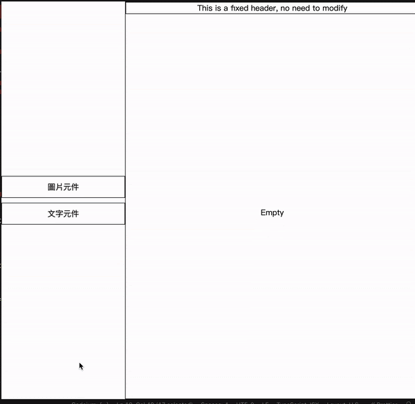

# Meepshop Demo

## Requirements

- [v] [1. 使用 React 實現 gif 功能 （僅需滿足畫面上所需的資料) ](#1)
- [v] [2. 左側元件庫可以進行拖拉 (文字元件 , 圖片元件）](#2)
- [v] [3. 右側預覽功能，預覽元件點擊時開啟左側的編輯功能，編輯對應的屬性可以即時看到更新後的預覽](#3)
- [v] [4. 圖片可自行調整 UI](#4)
- [v] [5. 加分題一 加上輪播元件](#5)
- [v] [6. 加分題二 擴增任何你有想製作的 WYSIWYG 的元件，將文字編輯元件調整成 Rich Text Editor](#6)

## Demo

- ### Demo URL: [https://meepshop-test-oh1xrlctl-june50232s-projects.vercel.app/](https://meepshop-test-oh1xrlctl-june50232s-projects.vercel.app/)

  

- ### 加分題 Demo URL: [https://meepshop-test-c9dvt7e7b-june50232s-projects.vercel.app/](https://meepshop-test-c9dvt7e7b-june50232s-projects.vercel.app/)
  

## 1

> Requirement: 使用 React 實現以下 gif 功能 （僅需滿足畫面上所需的資料)



- React v18
- MUI v5
- Using Create React App
- Deploy to Vercel
- `npm start`: run the app. Open [http://localhost:3000](http://localhost:3000) to view it in your browser
- `npm test`: run the test
- `npm run build`: build the app

## 2

> Requirement: 左側元件庫可以進行拖拉 (文字元件 , 圖片元件）

- React-dnd v16

```jsx
// for left buttons
import { useDrag } from "react-dnd";

// function inside component
function DraggableButton({ label }) {
  const [{ isDragging }, drag] = useDrag(() => ({
    type: ItemTypes.BUTTON,
    item: { label },
    collect: (monitor) => ({
      isDragging: !!monitor.isDragging(),
    }),
  }));

  return (
    <Button
      ref={drag}
      variant="outlined"
      fullWidth
      style={{
        opacity: isDragging ? 0.5 : 1,
        cursor: "move",
        marginBottom: "8px",
      }}
    >
      {label}
    </Button>
  );
}
```

```jsx
// for right content
import { useDrag } from "react-dnd";

// function inside component
const [{ isOver }, drop] = useDrop(() => ({
  accept: ItemTypes.BUTTON,
  drop: (item) => {
    if (item.label === "圖片元件") {
      setElements((prevElements) => [
        ...prevElements,
        {
          url: "https://img.freepik.com/free-psd/3d-illustration-person-with-sunglasses_23-2149436188.jpg?size=338&ext=jpg&ga=GA1.1.2082370165.1716163200&semt=sph",
          width: "300px",
          height: "300px",
        },
      ]);
    } else if (item.label === "文字元件") {
      const newElement = {
        type: "text",
        text: "I am the best candidate!",
      };
      setElements((prevElements) => [...prevElements, newElement]);
    }
  },
  collect: (monitor) => ({
    isOver: !!monitor.isOver(),
  }),
}));
```

## 3

> Requirement: 右側預覽功能，預覽元件點擊時開啟左側的編輯功能，編輯對應的屬性可以即時看到更新後的預覽

```jsx
// for right preview

const handleElementClick = (e, element, index) => {
  e.stopPropagation();
  onSelectElement(element, index);
};
```

```jsx
// for left edit
onChange={(content) =>
  onUpdateElement({ ...selectedElement, text: content })
}
```

## 4

> Requirement: 圖片可自行調整 UI

```jsx
onChange={(e) => onUpdateElement({ ...selectedElement, height: e.target.value })}
```

## 5

> Requirement: 加分題一 加上輪播元件

- React-slick v0.21.2
- slick-carousel v1.8.1

```jsx
import Slider from "react-slick";
import "slick-carousel/slick/slick.css";
import "slick-carousel/slick/slick-theme.css";

<Slider autoplay autoplaySpeed={1500} speed={200}>
  {element.images.map((img, idx) => (
    <Box
      key={idx}
      component="img"
      src={img}
      alt="carousel"
      width="100%"
      height="100%"
    />
  ))}
</Slider>;
```

## 6

> Requirement: 加分題二 擴增任何你有想製作的 WYSIWYG 的元件，將文字編輯元件調整成 Rich Text Editor

- quill v1.3.7
- react-quill v1.3.7
- @quilljs/react-quill v1.3.7

```jsx
import ReactQuill from "react-quill";
import "react-quill/dist/quill.snow.css";

<ReactQuill
  theme="snow"
  value={selectedElement.text}
  onChange={(content) => onUpdateElement({ ...selectedElement, text: content })}
/>;
```
